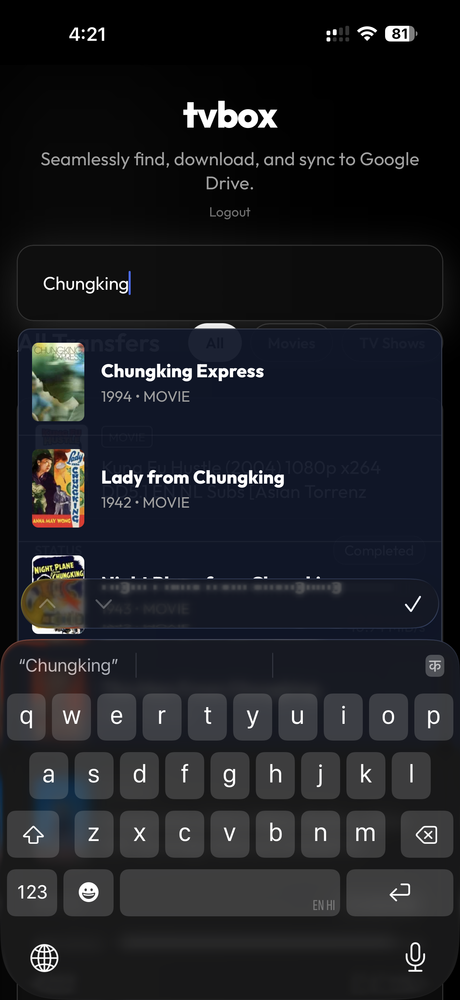
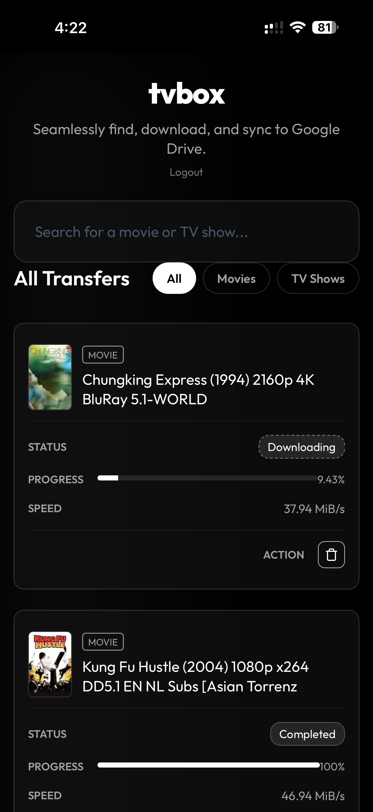
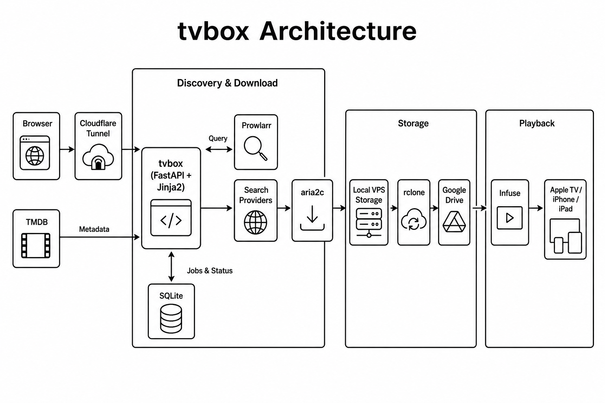

# tvbox

**Your personal, self-hosted Netflix.** Search for a movie or TV show in the browser, manage downloads from one dashboard, move completed files to Google Drive, and watch them through Infuse.

[](https://github.com/raunaqness/tvbox)
[](docker-compose.yml)
[](LICENSE)

<p align="center">
  
  &nbsp;&nbsp;&nbsp;
  
  &nbsp;&nbsp;&nbsp;
  
</p>

<p align="center">
  <sub>1. After Setup: Search for Movie / TVShow &nbsp;·&nbsp; 2. Downloads start in Background, and gets copied to Google Drive &nbsp;·&nbsp; 3. Watch it anywhere on Infuse (Apple TV supported)</sub>
</p>

## Why tvbox?

How many times have you searched for a movie only to find it unavailable on every streaming platform in your country? Search results often point to services like MUBI or Amazon Prime, but the title disappears when you open the page from your region.

tvbox solves that fragmentation with one private workflow: **search → download → upload to Google Drive → watch in Infuse**.

## Deployment options

| Setup | Best for | Requires |
| --- | --- | --- |
| **Local** | Trying tvbox on your own machine | Docker, rclone, Google Drive, Infuse |
| **VPS (24×7)** | Always-on downloads and remote access | Everything above, plus a VPS |
| **Remote browser access** | Using tvbox from anywhere | Cloudflare account and a managed domain |

A local install is available at `http://localhost:8000` and does not require a VPS, domain, or Cloudflare Tunnel.

**Estimated setup time:** 1–2 hours for a first deployment.

## Full setup guide

For step-by-step instructions—including headless Google Drive authentication with rclone, Prowlarr setup, Cloudflare Tunnel, and Infuse—read the walkthrough on Medium:

**[tvbox: A Self-Hosted Netflix for Your Personal Media](https://medium.com/@raunaqness/tvbox-a-self-hosted-netflix-for-your-personal-media-c1900e1a03c6)**

## Architecture



```text
Browser → tvbox → TMDB metadata + torrent search → aria2c download
                                              ↓
Infuse ← Google Drive ← rclone upload ← completed file
```

- **FastAPI and Jinja2** provide the web interface and API.
- **TMDB** supplies titles, posters, and metadata.
- **Prowlarr and direct search providers** collect torrent candidates.
- **aria2c** downloads the selected release.
- **SQLite and SQLAlchemy** persist download history and status.
- **rclone** moves completed downloads to Google Drive and removes the local copy.
- **Cloudflare Tunnel** can expose the password-protected app without opening the web port publicly.
- **Infuse** connects to Google Drive and provides the final browsing and playback experience.

## Features

- Movie and TV autocomplete powered by TMDB
- Poster thumbnails in the transfer dashboard
- Concurrent torrent search, deduplication, and seeder-aware ranking
- Preference for healthy 4K releases with automatic 1080p fallback
- Automatic retry with another candidate when a download remains stalled
- Live progress, speed, history, retry, and deletion controls
- Asynchronous Google Drive uploads
- Automatic host storage cleanup after a successful upload
- Password-protected browser access
- Docker Compose deployment for local or VPS use

## Requirements

**Core (local or VPS):**

- Docker and Docker Compose
- Git and rclone
- A Google Drive account with enough storage
- An Infuse account and a supported playback device
- A free [TMDB API key](https://www.themoviedb.org/settings/api)
- `rclone` configured with a remote named `gdrive`

**Optional (24×7 remote access):**

- A Linux VPS with enough temporary disk space for one complete download
- A domain managed by Cloudflare
- A Cloudflare account with Cloudflare Tunnel access

Leave enough free disk space for the largest file you expect to download. tvbox stores each file locally until its Google Drive upload completes.

## Quick start

1. Clone the repository:

   ```bash
   git clone https://github.com/raunaqness/tvbox
   cd tvbox
   ```

2. Copy the example environment file and fill in your values:

   ```bash
   cp .env.example .env
   ```

3. Configure Google Drive with rclone and name the remote `gdrive`:

   ```bash
   rclone config
   rclone mkdir gdrive:/Media
   ```

   On a headless VPS, run `rclone authorize "drive"` on a computer with a browser and paste the token back into the VPS. See the [Medium walkthrough](https://medium.com/@raunaqness/tvbox-a-self-hosted-netflix-for-your-personal-media-c1900e1a03c6) for full instructions.

4. Start the stack:

   ```bash
   docker compose up -d --build
   ```

5. Open tvbox at `http://localhost:8000` and sign in with `APP_PASSWORD`.

6. Configure indexers in Prowlarr at `http://localhost:9696`, copy its API key into `.env`, and restart the app:

   ```bash
   docker compose restart app
   ```

7. Add the same Google Drive account to Infuse and select the folder configured by `RCLONE_REMOTE`.

8. **Optional:** Configure Cloudflare Tunnel for remote access. Add `CLOUDFLARE_TUNNEL_TOKEN` to `.env`, point a hostname at `http://app:8000`, and restart `cloudflared`.

The stack also includes FlareSolverr for indexers that require it. Do not expose Prowlarr, aria2 RPC, or FlareSolverr to the public internet.

## Configuration

Copy `.env.example` to `.env` before starting the stack.

| Variable | Purpose | Default |
| --- | --- | --- |
| `TMDB_API_KEY` | TMDB search and metadata | None |
| `PROWLARR_API_KEY` | Prowlarr API access | None |
| `PROWLARR_URL` | Internal Prowlarr URL | `http://localhost:9696` |
| `ARIA2C_HOST` | aria2 RPC host | `http://localhost` |
| `ARIA2C_PORT` | aria2 RPC port | `6800` |
| `ARIA2C_SECRET` | aria2 RPC secret | None |
| `APP_PASSWORD` | Web login password | `admin` |
| `SECRET_KEY` | Session-signing key | `fallback_secret` |
| `RCLONE_REMOTE` | Upload destination | `gdrive:/Media` |
| `DOWNLOADS_DIR` | Local download directory | `./downloads` |
| `CLOUDFLARE_TUNNEL_TOKEN` | Cloudflare Tunnel token for remote access | None |

Always override the default password and session secret in production.

## Services

| Service | Role | Default port |
| --- | --- | --- |
| `app` | tvbox web app and API | `8000` |
| `aria2c` | Download engine and RPC server | `6800` |
| `prowlarr` | Indexer manager | `9696` |
| `flaresolverr` | Optional anti-bot helper for Prowlarr | `8191` |
| `cloudflared` | Private remote access tunnel | None |

## FAQ

**Do I need a VPS?**  
No. tvbox runs locally with Docker. A VPS is only needed for 24×7 availability.

**Do I need Cloudflare?**  
No. Cloudflare Tunnel is optional and only required for secure remote browser access.

**Do I need Infuse?**  
Infuse is the recommended playback client in this workflow, but any app that can stream from Google Drive works.

**Can I use Plex or Jellyfin instead?**  
Not out of the box. tvbox uploads to Google Drive; Infuse is the documented playback path.

**How long does setup take?**  
Most first-time deployments take 1–2 hours, mainly for rclone auth, Prowlarr indexers, and Infuse.

## Development and tests

Install the Python dependencies and run the test suite:

```bash
python -m pip install -r requirements.txt
PYTHONPATH=. pytest tests/
```

## Troubleshooting

- **Downloads remain at 0 B/s:** Verify that the torrent has active seeders and that TCP/UDP port `6888` is allowed. Some VPS providers block torrent traffic entirely.
- **Prowlarr returns no results:** Confirm that its indexers pass their built-in tests and that `PROWLARR_API_KEY` is correct.
- **Uploads fail:** Run `rclone lsd gdrive:` on the host, then `docker compose exec app rclone lsd gdrive:` to confirm the container can read the same credentials.
- **The app is unreachable remotely:** Check the Cloudflare Tunnel route and confirm that its origin points to `http://app:8000`.
- **Infuse cannot see new files:** Confirm the upload folder in `RCLONE_REMOTE`, then refresh the matching Google Drive share in Infuse.
- **Posters do not appear after backfill:** Hard-refresh the browser or purge Cloudflare cache if you use a tunnel.

## Security notes

- Keep all API keys, tunnel tokens, RPC secrets, and passwords out of Git.
- Use `.env` for secrets; never commit real credentials.
- Expose the app through Cloudflare Tunnel for remote access; do not publicly expose its origin port.
- Restrict ports `6800`, `8191`, and `9696` to trusted administrators.
- Rotate any credential that has previously been committed.

## License

tvbox is released under the [MIT License](LICENSE).
